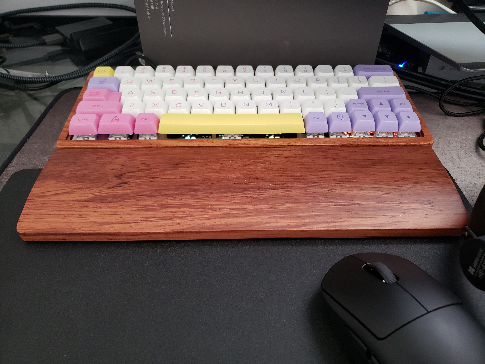

  

This project had been in my backburner for a few years now. My interest in the hobby had grew over time so I was excited once I clicked the purchase button. The parts included a keyboard PCB (DZ60), key switches (Kalih Box White), keycaps (NP Ice Cream), and a keyboard case (Solid Wooden Case).

I had soldered before in my spare time, so there was no difficulty soldering the key switches to the PCB. Soldering took a solid hour and a half which is about the average time it should take.

I had to program the keyboard using an online tool called QMK. The link to the software can be found here: https://config.qmk.fm/. It took me a good hour or two to really understand how to realy fully use the software for my keyboard. After that, I was able to configure the layout I wanted.

## Final Thoughts

The process went smoother than anticipated. I thought that I would run into many more bumps in this project, but I ended up having a swell time. The finished product is something I can be proud of.
